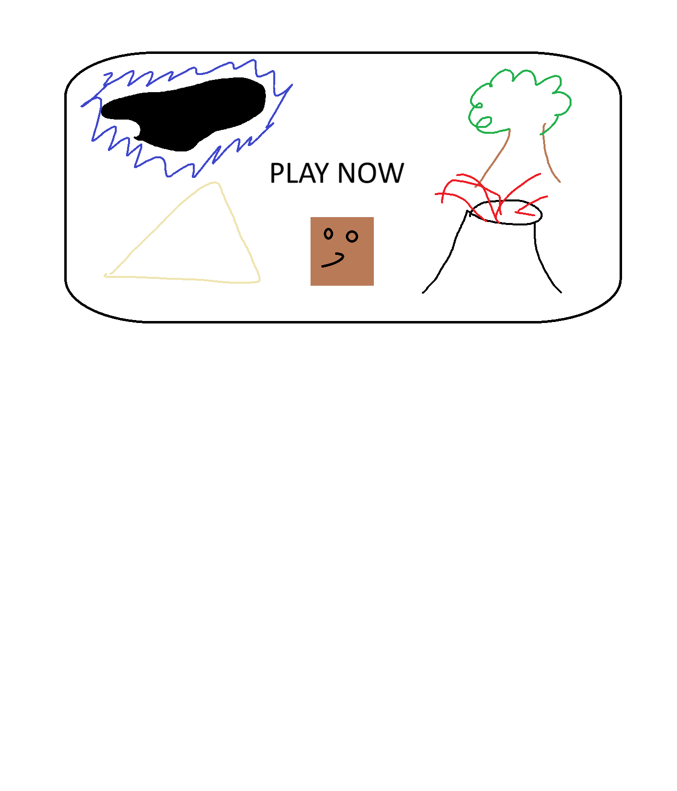

# Crusty Crusade: The Quest for Toastination
## CS110 Final Project - Spring, 2024 

## Team Members

Noah Gallagher

***

## Project Description

"Crusty Crusade: The Question for Toastination" is a 2D platformer game in which a brave piece of bread will attempt to navigate through a randomly generated maze which contains randomly placed obstacles such as butter knives and moldy bread. The piece of bread must jump into the magical volcano in less than 90 seconds in order to become the almighty toast!

***    

## GUI Design

### Initial Design

### Final Design

## Program Design

### Features

1. Moveable Character
2. Randomly Generated Maze and Obstacles
3. Maze Collisions
4. Obstacle Collisions 
5. Enemy Collisions
6. Game Ending Screen
7. Keybinds
8. Timer

### Classes

- Controller: The holy grail of this project. It handles user input, interprets that information, communicates with data models to carry out tasks, and handles events. 
- Bread: Bread is the movable character in the game. He is able to move left, right, and he can jump... somehow. Represents the main sprite in the game which is the playable character. 
- Obstacle: A multitude of stationary objects will be in the game. Represented by the butter knife sprite. If you touch it, YOU DIE!!!
- Movable Obstacle: Represented by the moldy bread sprite (ew). If you touch it, the mold will spread to you and you perish. 
- Volcano: Represented by the giant volcano sprite. This magical volcano is the ultimate goal. Reach it, and you become the almighty toast!
- Maze: This labyrinth is randomly generated. Follow its path to the magical volcano.

## ATP
- Test Case 1: Player Movement
    - Test Description: Verify that the bread moves left, right, and can jump as expected.
    - Test Steps:
    1. Start the game
    2. Press the 'A' key 
    3. Verify that the bread moves left
    4. Press the 'D' key
    5. Verify that the bread moves right
    6. Press the 'W' key
    7. Verify that the bread moves up/jumps (the bread has infinite jumps)
    - Expected Outcome: The player’s bread should move left, right, and up/jump in response to the key inputs

- Test Case 2: Collision Detection
    - Test Description: Ensure that collisions between the bread and obstacles are detected correctly.
    - Test Steps:
    1. Start the game
    2. Run into a wall
    3. Verify that the bread is stopped by the obstacle
    4. Run around and don’t touch anything
    5. Verify that no collision is detected
    - Expected Outcome: Moving around should correctly collide or not collide with something. 

- Test Case 3: Game Over Condition
    - Test Description: Confirm that the game ends when the player runs into a butter knife, moldy toast, or volcano. Additionaly, if the clock runs out of time, the game will also end.
    - Test Steps:
    1. Start the game
    2. Run into a butter knife or moldy toast
    3. Verify that you die and the game ends and it says "Game Over!"
    4. Run into the volcano
    5. Verify that you win the game and it says "Toasted!!!"
    - Expected Outcome: The game should either display "Game Over!" or "Toasted!!!" depending upon which condition you're testing. (If you're unable to make it to the end, you can jump over the entire maze and fall down to the volcano to check if it says "Toasted!!!" I swear it pops up.)

- Test Case 4: Timer Functionality
    - Test Description: Confirm that the timer functions correctly and triggers the game over condiion when it runs out of time.
    - Test Steps:
    1. Start the game
    2. Let the timer run out of time
    3. Verify that the game ends and displaus "Game Over!"
    - Expected Outcome: The timer should accurately count down from 1:30 to 0. 

- Test Case 5: Maze and Obstacle Generation
    - Test Description: Confirm that the maze and obstacles are randomly generated every time.
    - Test Steps:
    1. Start the game
    2. Observe that the maze is randomly generated every time
    3. Make sure you are able to navigate through the maze to the volcano
    4. Oberve that the obstacles are randomly generated every time
    - Expected Outcome: The randomly generated maze should have a layout which you are able to navigate through and the randomly generated obstacles should be placed throughout the maze.

